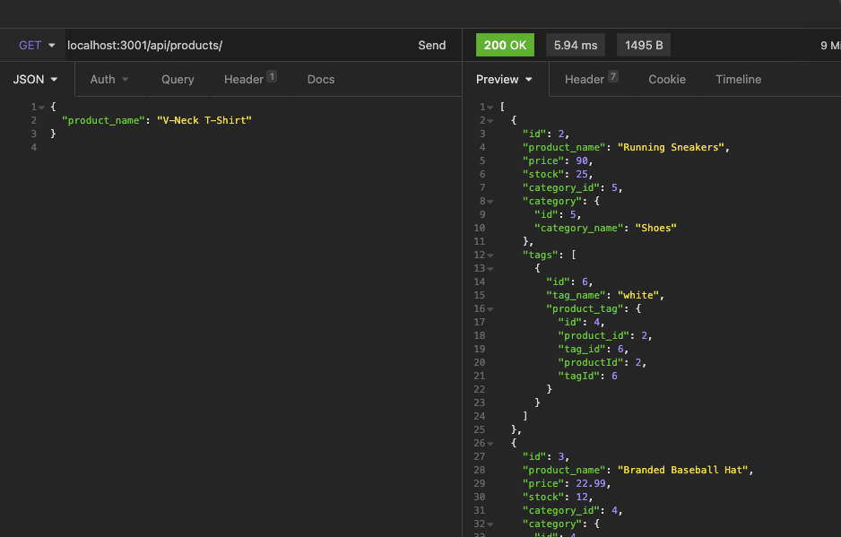

# E-Commerce Back End

## Description
This is the back end for a simple e-commerce site.
## Table of Contents
- [Installation](#installation)
- [Usage](#usage)
- [Contributions](#contributions)
- [Testing Information](#testing)
- [License](#license)
- [Questions](#questions)
## Installation
Install Node modules and enter npm run start in the command line.
## Usage
This is an application that is run through the command line and insomnia. An application walkthrough can be found [here](https://youtu.be/C9Op--QZzNY).

## Contributions

## Testing
No tests available for this application.'.

## License
This project is covered under a/an MIT license. For more information see GitHub documentation on licensing a project [here](https://docs.github.com/en/communities/setting-up-your-project-for-healthy-contributions/adding-a-license-to-a-repository).

## Questions
​For questions, get in touch on [GitHub](https://github.com/bryan-barnes12/) or email me at [theonlysweetbeebles@gmail.com](mailto:theonlysweetbeebles@gmail.com).
    